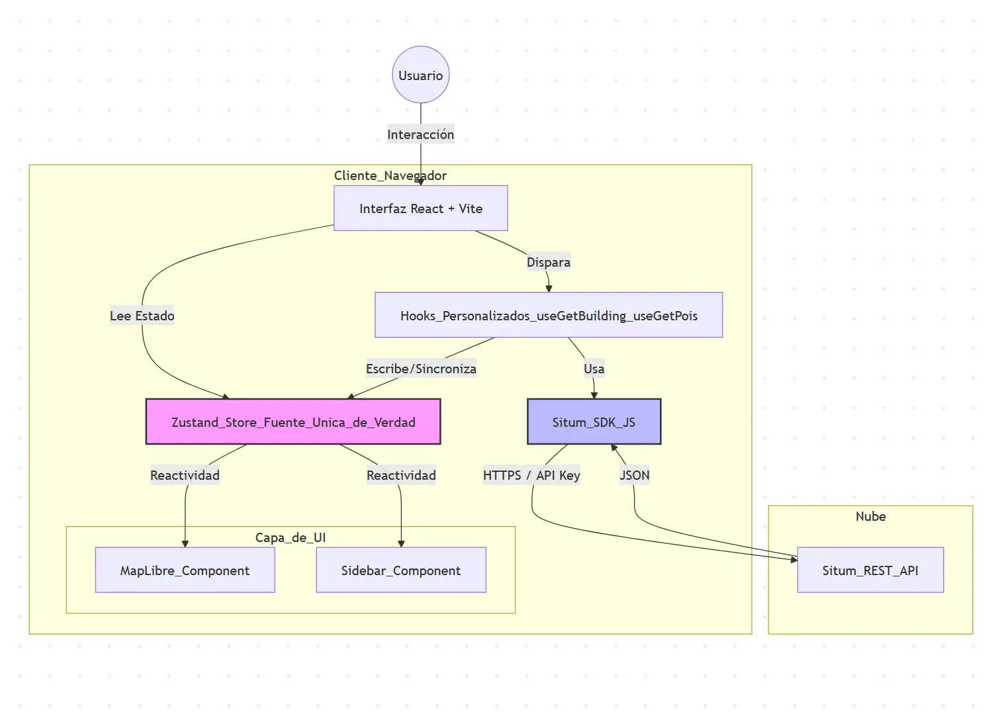
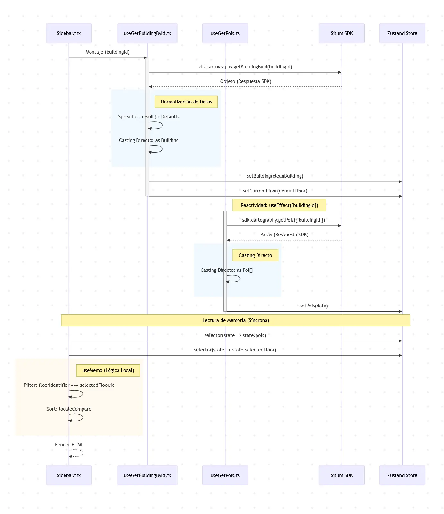
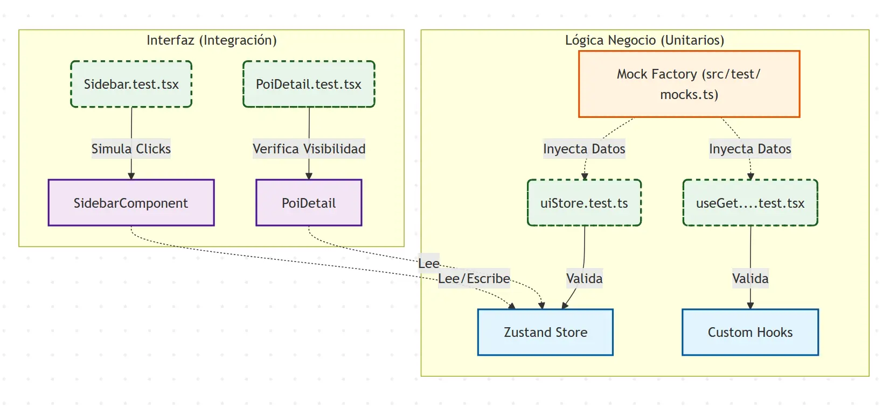

# Arquitectura y Flujo de Datos

Este documento describe la arquitectura de alto nivel, los patrones de diseño y los flujos de datos principales del proyecto para visualización de interiores basado en Situm..

### 1. Diagrama de Arquitectura de Alto Nivel

El sistema sigue una arquitectura Unidireccional basada en un Store Global. Los componentes UI son "consumidores tontos" (dumb components) que solo reaccionan a cambios en el estado, mientras que la lógica de negocio reside en Hooks personalizados.



### 2. Diagrama de Secuencia: Flujo de Carga y Filtrado

A diferencia de una carga secuencial tradicional, utilizamos un patrón de reacción. El hook de POIs no se dispara hasta que el hook de Edificio ha inyectado el edificio en el Store.

- Carga del Edificio: Se obtiene la geometría y plantas. Se establece la planta 0 por defecto.

- Reacción: useGetPois detecta que ya hay un edificio cargado y descarga los POIs.

- Filtrado en UI: La Sidebar y el MapComponent leen los POIs brutos del Store y aplican filtros (por planta) antes de renderizar.



### 3. Esquema de Datos (Store Global)

En lugar de un esquema de base de datos relacional (como en el backend), la persistencia en memoria se gestiona a través de una interfaz de estado global en Zustand.

- building: Almacena la entidad raíz. Contiene la geometría, esquinas (corners) y array de plantas (floors). Es la referencia principal.

- pois: Lista plana de todos los puntos de interés del edificio. No se almacenan agrupados por planta para facilitar búsquedas globales.

- currentFloor: Referencia a la planta activa. Actúa como filtro principal para la vista.

- selectedPoi: Referencia al POI seleccionado actualmente. Controla el resaltado en el mapa y el scroll y resaltado en la lista.

- isPopupOpen: Almacena el estado que afecta a la apertura del popup que muestra detalles del POI desde el mapa.

```typescript
interface UIState {
  // Datos de Dominio (Caché)
  building: Building | null;
  pois: Poi[];

  // Estado de Interfaz (UI)
  selectedFloor: Floor | null;
  selectedPoi: Poi | null;
  isPopupOpen: boolean;

  // Acciones (Setters)
  setBuilding: (building: Building | null) => void;
  setPois: (pois: Poi[]) => void;
  setSelectedFloor: (floor: Floor | null) => void;
  setSelectedPoi: (poi: Poi | null) => void;
  setIsPopupOpen:(isOpen: boolean) => void;
}
```

## Arquitectura de test




## Cobertura de test

