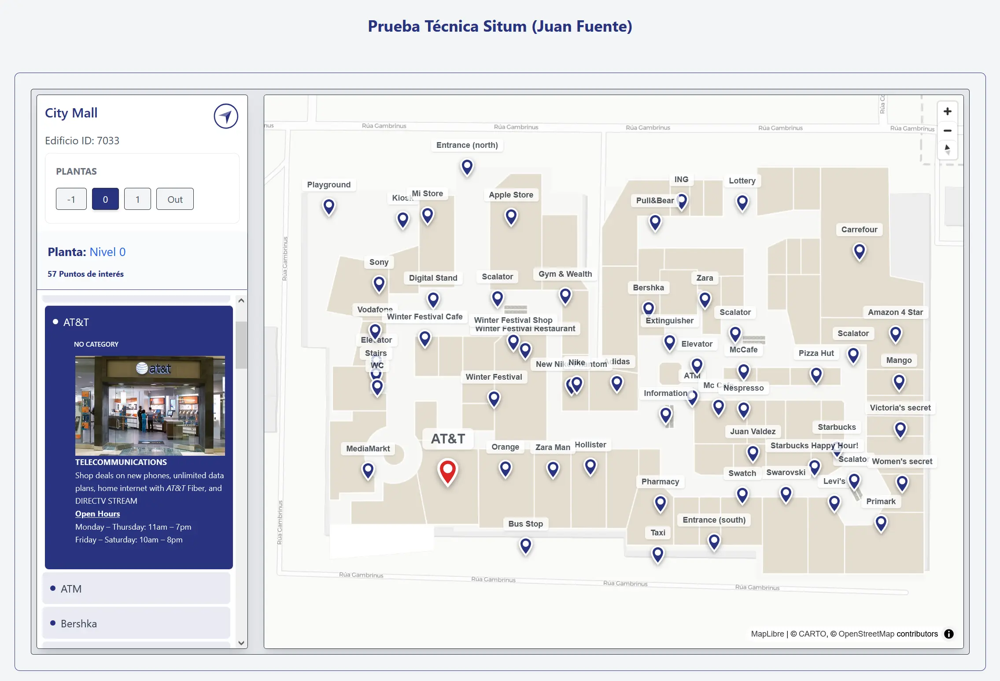
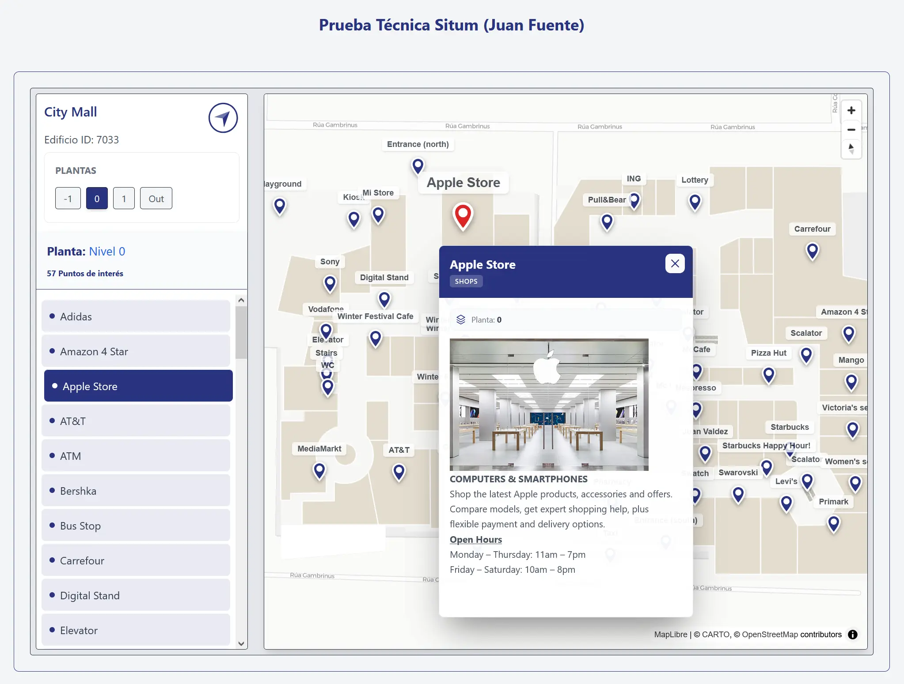
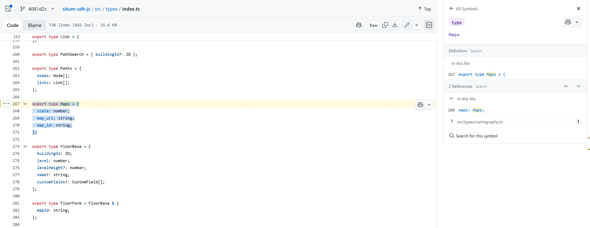
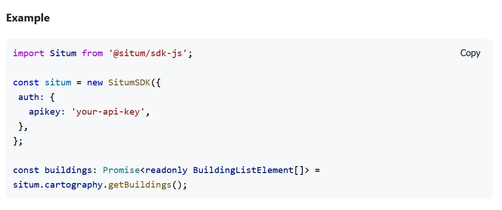

# Situm Maps Explorer Test - Indoor Viewer

Aplicación SPA (Single Page Application) desarrollada con React, TypeScript y Vite para la visualización de cartografía de interiores utilizando el ecosistema de Situm. Consume la API pública con el SDK-JS para renderizar edificios, plantas y puntos de interés (POIs) de forma interactiva.

[App desplegada en Vercel](https://situm-indoor-maps-explorer.vercel.app/)

* **Nota:** El despliegue en Vercel cuenta con un pipeline de CI/CD que ejecuta y valida todos los tests unitarios y de integración antes de publicar cualquier cambio.

* **Nota:**  El proyecto está completamente Dockerizado y listo para ser ejecutado localmente de forma sencilla. Consulta la sección de "Instalación y Ejecución" para más detalles.






## Stack Tecnológico

- **Core:** React 18, TypeScript, Vite.
- **Cartografía:** MapLibre GL JS (WebGL), Situm SDK.
- **Estado Global:**  Zustand. TanStack Query.
- **Estilos:** TailwindCSS.
- **Calidad:** Vitest, React Testing Library, ESLint.
- **Infraestructura:** Docker, Nginx (Producción).

## 💡 Decisiones Técnicas de Arquitectura

* React + TS + Vite: Velocidad de desarrollo (DX) y seguridad de tipos (Null safety).

* Zustand: Estado global simplificado y rendimiento (suscripciones atómicas).

* TanStack Query: Gestión eficiente de estado asíncrono y caché.

* TailwindCSS: Desarrollo ágil de UI y consistencia visual.

* Vitest: Testing unitario rápido con configuración nativa de Vite.

* MapLibre GL: Mapa vectorial interactivo ligero con buena integración con React.

## 📂 Estructura del Proyecto
La arquitectura sigue una separación estricta entre Lógica de Negocio (Hooks/Stores) y Presentación (Components).

```text
src/
├── components/
│   ├── MapComponent.tsx           # Visualizador de MapLibre (Gestión de marcadores y Z-Index)
│   ├── PoiDetailComponent.tsx     # Popup flotante personalizado (React + Tailwind)
│   ├── SidebarComponent.tsx       # Orquestador del panel lateral (incluye PoisList y FloorSelector)
│   ├── FloorSelectorComponent.tsx # Subcomponente interno (Botonera selección plantas)
│   ├── PoisListComponent.tsx      # Subcomponente interno (Lista con scroll y acordeón)
│   ├── ErrorBoundary.tsx          # Manejo defensivo de errores en tiempo de ejecución
│   └── __tests__/                 # Tests de Integración de UI (Simulación de flujos)
│
├── hooks/
│   ├── useGetBuildingById.ts      # Servicio: Obtención y normalización del Edificio
│   ├── useGetPois.ts              # Servicio: Obtención reactiva de POIs
│   └── __tests__/                 # Tests Unitarios de Hooks (con Mocks del SDK)
│
├── stores/
│   ├── uiStore.ts                 # Store Global (Zustand): Fuente única de verdad
│   └── __tests__/                 # Tests Unitarios del Store (Lógica pura)
│
├── test/
│   └── mocks.ts                   # Factoría de Mocks (Tipado estricto según Situm SDK)
│
├── utils/
│   └── checkImage.ts              # Utilidad para validar activos externos rotos
│
├── App.tsx                        # Layout Principal
└── main.tsx                       # Punto de entrada
```

## Características Principales

### 🗺️ Visualización Cartográfica
- Renderizado vectorial de alto rendimiento usando **MapLibre GL**.
- Integración nativa con **Situm SDK** para la carga dinámica de la cartografía del edificio "7033".
- Marcadores interactivos en el mapa que reaccionan a la selección. Al clicar en ellos se abre un **Tarjeta flotante** con detalles. Esta tarjeta se cierra automáticamente al clickar sobre el mapa o interactuar con la lista para no obstruir la visión ("Foco Contextual").
- **Z-Index Dinámico:** Lógica de apilamiento visual para que el marcador seleccionado o sobre el que se pasa el puntero siempre se muestre por encima de los vecinos, evitando ocultamiento.

### 🔄 Sincronización UI (Bidireccional)
- **Mapa -> Lista**: Al pulsar un marcador en el mapa, la barra lateral hace scroll automático (*scrollIntoView*) hasta el elemento correspondiente.
- **Lista -> Mapa**: Al seleccionar un POI en la lista, el mapa centra la vista en el marcador correspondiente y despliega su información.
- **Filtrado en Cliente**: La lista filtra los POIs en tiempo real según la planta seleccionada (`selectedFloor`), ordenándolos alfabéticamente tras sanitizar los nombres.

### ⚡ Arquitectura "Sync Pattern"
- **Desacople total**: Los componentes visuales no realizan peticiones de red.
- **Inyección Reactiva**: Hooks autónomos (`useGetPois`, `useGetBuildingById`) inyectan los datos en el Store de Zustand en cuanto están disponibles.

### ✨ Atención a la calidad y aspecto visual
- **Tipado estricto** Para cumplir con el estandar del SDK se usaron los tipos estrictos provistos.
- **Robustez en Testing** Decisión de usar una **Mock Factory** para centralizar los objetos de los tests. Alto **Coverage** alcanzado con Vitest.
- **Identidad Corporativa:** Adaptación meticulosa de colores (Azul Situm) o  imagen corparativa de Situm (favicon en navegador) para integración visual con la marca.


## Arquitectura

Para un desglose detallado de la arquitectura de la aplicación, el flujo de datos y los diagramas de secuencia, consulte el documento **[ARQUITECTURA.md](ARQUITECTURA.md)**.

### 💡 Decisiones técnicas relevantes y soluciones UX

* **Renderizado Crítico (CSS Race Conditions):** El mapa cargaba con altura 0px debido a la carga asíncrona de clases Tailwind. Se forzó `style={{ height: '800px' }}` inline para garantizar dimensiones físicas antes de la instanciación del contexto WebGL.

* **Gestión de Errores en Datos (Imagen Rota):** La API devuelve una URL corrupta para el plano del edificio 7033. Se implementó una utilidad defensiva (`checkImage`) para validar el recurso antes de intentar pintarlo, evitando errores en consola.

* **Manejo de Texturas Binarias (Blob):** La URL del plano proporcionada por la API no funcionaba como un enlace de imagen estándar, requiriendo un tratamiento como dato binario. Se implementó una descarga manual mediante fetch para convertir la respuesta en un Blob y generar una URL local temporal (URL.createObjectURL), permitiendo que el motor de renderizado de MapLibre procese la textura correctamente.

* **Corrección de Tipado (SDK vs API):** Se detectó y solucionó una discrepancia entre los tipos oficiales del SDK (definidos en snake_case) y la respuesta real de la API (en camelCase). Se aplicó un patrón de extensión de tipos en TypeScript para normalizar los datos y evitar errores de compilación sin perder la seguridad de tipos.

* **Decisiones de UX:** Se optó por un mapa estático al seleccionar un POI, descartando la animación de cámara (flyTo) que desorienta al usuario.

**Sincronización Bidireccional** (Lista <-> Mapa). Al clicar en la lista, el POI se ilumina en el mapa. Al clicar en el mapa, el POI se resalta en la lista.

**Ordenación Alfabética** de los POIs para hacer intuitiva la búsqueda.

**Scroll Virtual:**: Se limita la altura visible de la lista para limitar tamaño, centrandose automaticamente si un POIs es seleccionado en el mapa.

* **Adaptabilidad (Responsive Design):** Se refactorizó la interfaz para garantizar una experiencia fluida en dispositivos móviles y tablets:

**Layout Reactivo:** Cambio automático de una distribución de paneles laterales (Desktop) a una pila vertical (Mobile).

**Zoom Dinámico:** Implementación de breakpoints lógicos en el mapa que ajustan automáticamente el nivel de zoom y el centrado según el ancho del dispositivo.

**Controles Táctiles:** Adaptación del selector de plantas a scroll horizontal y ajuste dimensional de los popups y listas para maximizar el área útil del mapa en móviles.

* **Conflicto Visual (Popup vs Mapa):** El popup nativo de MapLibre se cortaba en los bordes del límite visible del mapa (clipping). Se reemplazó por un componente React flotante (`PoiDetail`) posicionado absolutamente sobre el mapa, permitiendo libertad de diseño y animaciones. Este popup no se posicionaba de modo relativo al POI seleccionado, por lo que era molesto en cuanto a UX a la hora de ver el mapa. Se decició abrirlo solo desde el mapa y mostrar informacion en la lista lateral cuando se selecciona un POI desde allí **Foco Contextual**. También ha dejado de abrirse en móvil desde la lista de Pois para no interferir con la visión del mapa.

* **Gestión de Z-Index Dinámico:** Para evitar que marcadores solapados se oculten entre si, se implementó lógica de ordenación visual donde el POI seleccionado recibe `z-index: 50` y el *hover* `z-index: 40` que evita que sean solapados por otros.

* **Evolución Arquitectónica:** El proyecto evolucionó de una estructura monolítica inicial a una arquitectura basada en un estado global, Hooks autónomos y Componentes sin lógica (Presentacionales) para mejorar la mantenibilidad y testabilidad.

## Arquitectura

Para un desglose detallado de la arquitectura de la aplicación, el flujo de datos y la arqutectura de test, consulte el documento **[ARQUITECTURA.md](ARQUITECTURA.md)**.


## ⚙️ Instalación y Ejecución

### 🚀 Instalación

1. Clonar el repositorio:
```bash
git clone https://github.com/Juan-Fuente-T/situm-indoor-maps-explorer.git
```
2. Entrar en el directorio:
```bash
cd situm-indoor-maps-explorer
```
3. Instalar dependencias:
```bash
npm install
ó
pnpm install
ó
yarn install
```

### 🧪 Modo desarrollo

- Para levantar el servidor local:
```bash
npm run dev
```
- Esto iniciará la aplicación normalmente en:
```bash
http://localhost:5173/
```

### 🏗️ Build de producción

- Generar la build optimizada:
```bash
npm run build
```
- Y para previsualizarla localmente:
```bash
npm run preview
```
### Ejecución de Tests

El proyecto cuenta con una batería de tests automatizados para garantizar la estabilidad del código.

```bash
# Ejecutar todos los tests (modo consola)
npm run test

# Abrir interfaz gráfica de Vitest (UI)
npm run test:ui

# Generar reporte de cobertura de código
npx vitest run --coverage
```

## ⚠️ Problemas detectados

* **Desajustes de valores:** Existe un desajuste de tipos entre el SDK y la API (map_url vs mapUrl) en [Situm Types](https://github.com/situmtech/situm-sdk-js/blob/4081d2cb7cb37d063f8a56895f06a31d86ed44f1/src/types/index.ts#L267)



* **Clipping MapLibre:** Se sustituyeron los popups nativos por un componente React flotante (PoiDetailComponent) para evitar cortes en los bordes.

* **Error en Documentación:** Pequeño error en la documentación en [Situm SDK](https://developers.situm.com/sdk_documentation/sdk-js/classes/SitumSDK.html)
Está importando Situm pero instanciando SitumSDK


